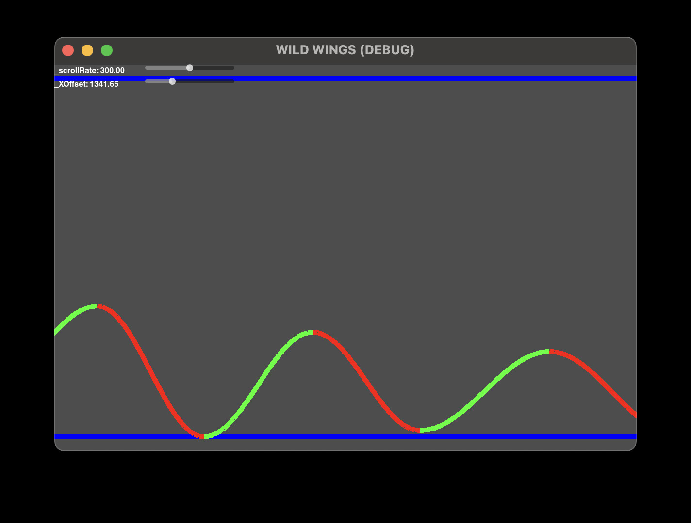

# Wild Wings (Tiny Wings inspired game)
## Project Info

-   Godot Version: 3.4
-   scripts written in C#

## Build steps (WIP)

-   Open the project with Godot 3.4
-   ideally you should be able to build with `F5` or `CMD-B` (mac)

## changelog

-   built random hill generator (`scripts/HillGenerator.cs`)
-   wrote basic hill drawing logic (`scripts/Hill.cs`)
-   added progressive scrolling (`scripts/Hill.cs`)
-   added Label/slider class for display debug info (`scripts/DebugLabel.cs`)

## Screencaps

-   Day 1:

